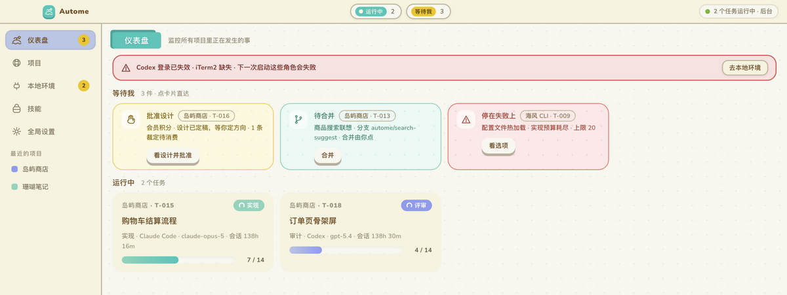
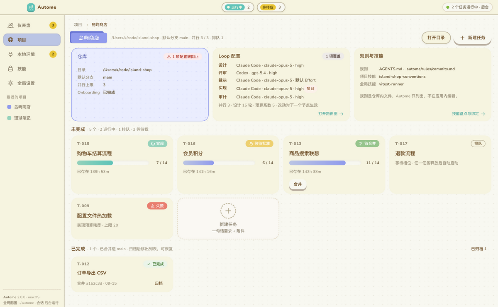
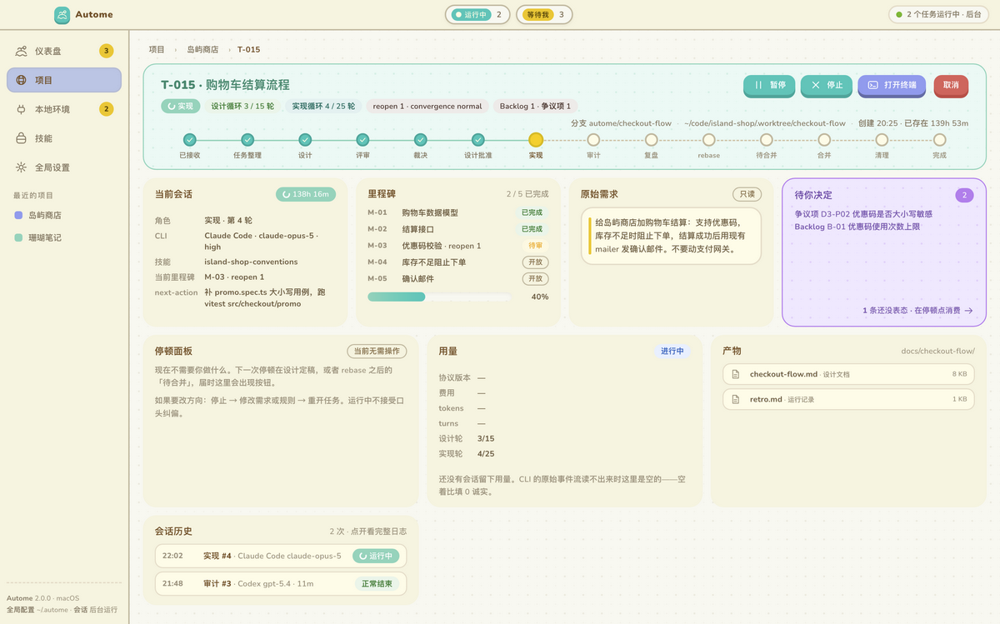
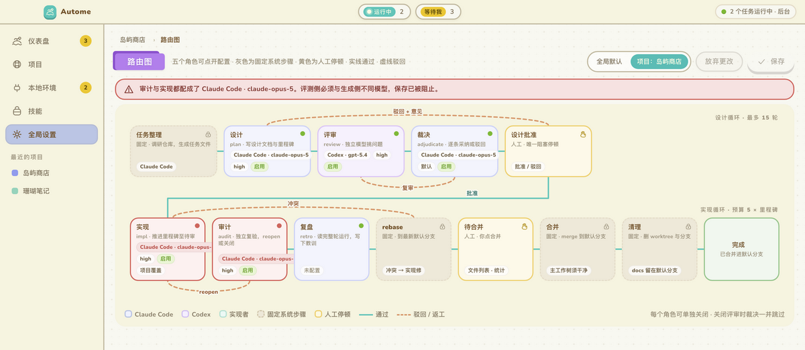
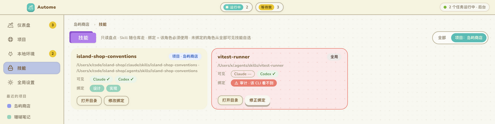
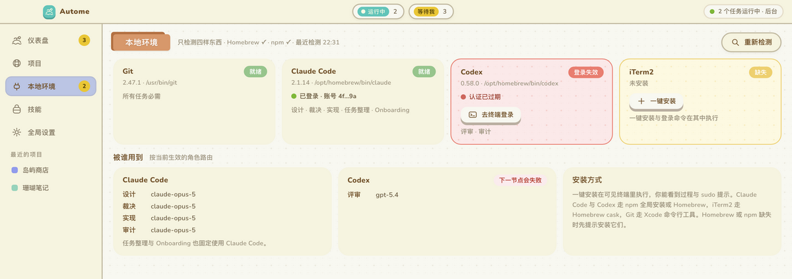

# Autome 2.0

A macOS desktop app that turns a one-line request into a merged branch.

You point it at a Git repository and type what you want. It runs Claude Code
and Codex through a five-role loop — design, review, adjudicate, implement,
audit — in a dedicated worktree, and stops for you exactly twice: once to
approve the design, once to press merge.

## What it looks like

Every screenshot below is the real renderer, captured by `apps/desktop/tools/
screenshots.js` from the test fixtures — the same fixtures the DOM suite
asserts against, so these cannot drift from the shipped screens. The projects,
tasks and skills in them are invented.

**The dashboard** — everything waiting on you, across every project, above
everything that is running. Nothing else competes for the space.



**A project** — the repository as Autome sees it, the Loop configuration in
force, the rules and skills that will be in the prompt, and every task.



**A task** — which node it sits at, the milestones it has closed, what the
current session is doing right now, and what it has produced. The stopping
panel says whether it needs you, and says so in the same place every time.



**The routing graph** — which CLI, model and effort runs each role, global or
per-project. The banner is the SAME-MODEL rule refusing to save a
configuration where audit and implementation share a model.



**Skills** — a read-only inventory of what the two CLIs can see, and which
roles are bound to use each one. The red card is a skill bound to a role whose
CLI cannot see it.



**Local environment** — the four things Autome needs, whether each is
installed and logged in, and which roles stop working if one is not.



## The shape of it

```
Electron (UI only)  ──framed JSON-RPC over stdio──  automed (Rust, all state)
                                                          │
                                              ┌───────────┼───────────┐
                                           git/worktree  iTerm2   .autome/ · docs/
                                                          │
                                                   claude / codex
```

Three properties the design turns on:

- **The core owns every node transition.** An agent writes its result into the
  design document and exits; the scheduler reads the document and decides what
  runs next. That is what makes pause, the parallel limit, role toggles, round
  budgets and the two stopping points enforceable by the core rather than by
  the cooperation of a prompt.
- **Task progress lives in the repository**, in the design document's status
  block. It travels with the branch and survives a machine change. SQLite holds
  the registry, the index, the session ledger and your decisions.
- **Generation and evaluation never share a model.** Review must differ from
  design, and audit from implementation. A configuration that violates this
  cannot be saved.

Sessions run in a visible terminal, so you can watch them. Autome never pushes,
never opens a pull request, and never merges without you pressing the button.

## Layout

- `crates/autome-domain` — pure types and transitions. No I/O, no async, no
  SQLite. The five roles, the configuration overlay and its validation, the
  design-document parser, the task state machine.
- `crates/automed` — everything that touches the outside world: SQLite, Git,
  the session launcher, the scheduler, the environment probe, the skill scan,
  and the JSON-RPC surface.
- `apps/desktop` — the Electron shell. Two IPC channels with two independent
  allowlists; the renderer can never name a filesystem path.
- `docs/development/requirements.md`, `docs/development/technical-design.md` —
  mirrored from the authoring repository; see below.
- `docs/adr/` — the two decisions that shaped the repository.

## Where your state lives

One home, `~/.autome`, overridable with `AUTOME_HOME`:

```
~/.autome/
├── config.toml                 # global defaults; yours to edit
├── protocol/                   # the protocol repository, a real git repo
└── state/
    └── automed.sqlite3         # registry, session ledger, your decisions
```

Per-project overrides live in each repository's `.autome/config.toml` and are
committed; task progress lives in the design document's status block, on the
branch. `AUTOMED_DB_PATH` overrides the database alone, which is how the test
suites get one each.

The database used to default to `automed.sqlite3` in the working directory,
and the desktop app kept its own under Electron's `userData`. That made a
second installation the CLI could not see, and put the only ledger in a
directory Chromium owns — where, on the machine this was found on, a dead
prototype's database had been squatting on the path.

## Authority

The specification lives in the sibling 1.x repository as a read-only reference
(ADR-0001), at `autome/docs/plans/`:

- `2026-09-15-autome-2.0-requirements.md`
- `2026-09-15-autome-2.0-technical-design.md`
- `2026-09-15-autome-2.0-project-task-ui-decisions.md` — the decision record
- `autome-2.0-desktop-ui.html` — the interaction design

The 2026-09-13 greenfield plan is historical; ADR-0002 records what it
specified, what survives, and why the rest was dropped.

## Building

```sh
cargo test                      # the domain, the core, and the end-to-end suite
cargo clippy --all-targets      # warnings are errors in CI
cd apps/desktop && npm test     # the shell, the gates and the renderer
```

All of the above at once, in the order and with the flags `.github/workflows/ci.yml`
uses:

```sh
sh scripts/ci-local.sh          # ~35s with a warm target/
sh scripts/ci-local.sh --package  # also builds the .app; minutes
```

This is not redundant with the workflow. There is no git remote, so the
workflow has never run — which is how its Format and Clippy gates came to be
147 and 38 findings deep without anyone being told. To have every commit run
it in the background:

```sh
git config core.hooksPath .githooks
```

Results land in `.git/ci-local/last.log` and in a desktop notification.
`NO_CI=1 git commit …` skips it for one commit.

The end-to-end suite drives a whole task from a one-line request to a merge
commit against a real Git repository, with a stand-in for the model. Nothing
else is substituted: real worktrees, the real wrapper script, the real
exit-marker protocol, a real rebase and a real merge.

### Against the real CLIs

A stand-in cannot catch a flag that does not exist, or one that means
something other than what you assumed — and that is the class of bug that bit
this project hardest. `tests/real_cli.rs` runs the real binaries:

```sh
# Free, no account: asks each CLI for its own --help and checks every flag
# we pass appears in it.
cargo test --test real_cli every_adapter_flag

# Costs money, needs a logged-in account.
AUTOMED_REAL_CLI=1 cargo test --test real_cli -- --nocapture

# The whole loop, real models, to a real merge commit. ~40 minutes.
AUTOMED_REAL_CLI=1 AUTOMED_REAL_LOOP=1 \
  cargo test --test real_cli the_whole_loop -- --nocapture --test-threads=1
```

## Status

The loop runs end to end against the real CLIs. Verified 2026-09-16 with
Claude Code 2.1.261 and Codex 0.153.4: a one-line request went through intake,
design, review, adjudication, the approval stop, implementation and an
independent audit, to a merge commit on `main` — six real sessions, the user
pressing two buttons.

### Packaging

```sh
sh scripts/package.sh            # unsigned .app and .dmg, for local use
CSC_NAME="Developer ID Application: …" sh scripts/package.sh   # signed
```

Signing is opt-in rather than best-effort: an unsigned build that claims to be
signed is worse than one that says it is not. The hardened runtime is on, so
`build/entitlements.mac.plist` declares every capability the app uses —
including AppleEvents, without which the session launcher cannot open a
terminal and every session fails to start, in signed builds only.

## Status

Feature-complete against the requirements document. The loop runs end to end
against the real CLIs, and `scripts/package.sh` produces a runnable macOS app.

Not done: signing and notarisation have configuration but have never been run
(no Developer ID here), there is no application icon, and `automed` is spawned
without verifying its signature or holding a single-instance lock.
